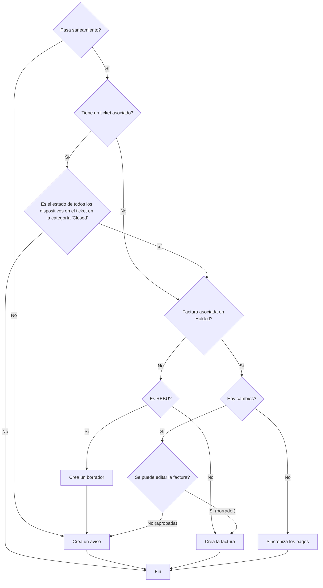

This program syncs invoices from RepairDesk over to Holded

## Flowchart

## Configuration
A sample configuration file can be found [here](./example.conf.jsonc), it must be located at `/etc/repairdesk-to-holded.conf.json` and must contain **no comments**
