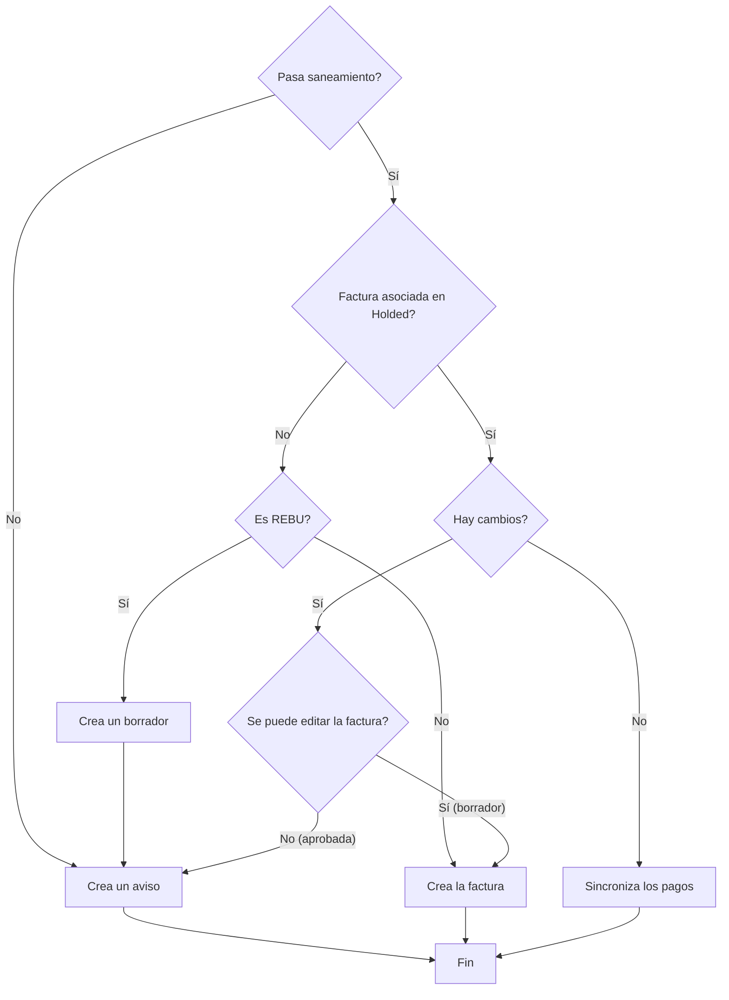

This program syncs invoices from RepairDesk over to Holded

## Flowchart

## Configuration
A mapping of tax classes from RepairDesk ids into Holded tax identifiers must be configured at `/etc/repairdesk-to-holded/tax-classes.json`
